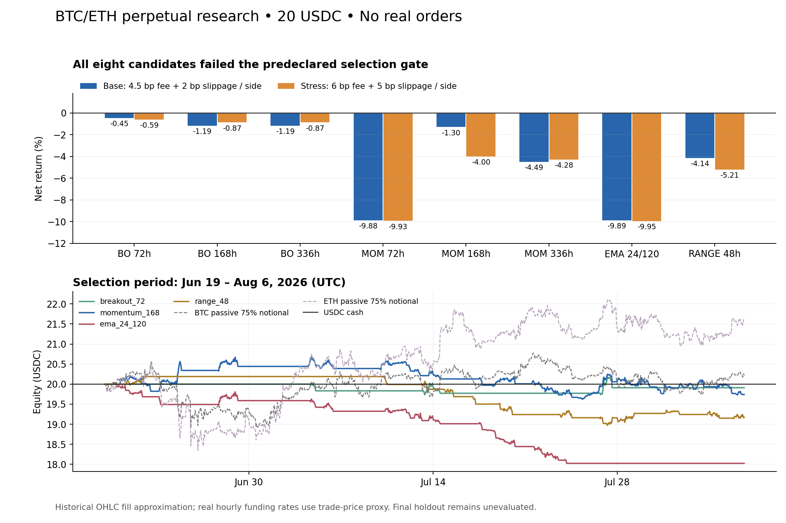

# 20 USDC / BTC、ETH 永续：第一轮策略实验结果

实验日期：2026-09-25。方案在计算收益前冻结。**结论：八个候选均未通过选择期；没有可晋级的策略，不请求真实交易授权。**

本轮完成的是可信研究基础、策略设计及一次有预先门槛的实验，不是已经具备盈利能力的自动交易系统。没有真实下单、加载钱包密钥、访问交易账户或启动旧机器人。

## 实验设计

只研究 Hyperliquid 的 BTC、ETH 永续，USDC 作为资金；每个实验从 20 USDC、空仓开始。同一时刻最多一个币种持仓，允许做多、做空或持币观望。新仓名义价值上限为 `min(15 USDC, 75%×净值)`，按 1% 净值计划止损预算进一步缩小；数量向下取整，达不到 10 USD 就跳过，不加杠杆凑单。

测试八个预先固定候选：72/168/336 小时突破、72/168/336 小时动量、EMA24/120 趋势、趋势平缓时的 48 小时均值回归。每四小时决策；信号只读已完成 K 线，在后续开盘价加不利滑点成交。止损距离为 3×ATR24，收盘后更新的移动止损只对下一小时生效；最长持有 168 小时，退出后冷却至少四小时，不加仓。

手续费对开平仓分别计算，基础每侧 4.5 bp，另加 2 bp 滑点；中度压力每侧 6 bp 手续费、5 bp 滑点。使用历史实际小时资金费率，正费率多头支付、空头收取。现金、已实现盈亏、手续费、资金费及未实现盈亏逐笔对账。

日内损失触发 3% 后锁定禁止当日新开仓，继续管理已有持仓；从观测高水位回撤触发 10% 后退出并锁定。10% 是触发线，不是损失绝不会超过的保证，成交费用、滑点与跳空可能越过该线。

## 数据和切分

冻结数据为每币 4,999 根完整小时 OHLC 和 4,999 个真实小时资金费率事件。范围为 **2026-02-28 00:00 UTC 至 2026-09-24 07:00 UTC，结束时刻不包含**。缺失、重复、未完成小时、BTC/ETH 对齐、OHLC 边界和 SHA-256 校验均通过。

| 区间 | 开始 UTC | 结束 UTC（不包含） | 小时数 | 用途 |
|---|---|---|---:|---|
| 预热 | 02-28 00:00 | 03-14 00:00 | 336 | 只计算指标 |
| 开发 | 03-14 00:00 | 06-19 00:00 | 2,328 | 检查候选与实现，不事后调参 |
| 选择 | 06-19 00:00 | 08-06 16:00 | 1,168 | 按预定标准选一个候选 |
| 保留 | 08-06 16:00 | 09-24 07:00 | 1,167 | 本轮未计算策略或基准收益 |

基础与中度压力情景必须各自净收益为正、最大回撤低于 8%、至少十笔完整交易且未发生账户风控停机，才有选择资格。若有候选，按中度压力净收益排序并先保存决定，再检验它的保留区间。此次无人合格，因此没有运行保留区间，也没有改选该区间赢家。

即使未来使用保留区间，它也只能称相对本轮选择过程保留的历史数据。它不是未来到来的前瞻样本，不能宣称人类或旧研究从未观察过相关行情。

## 选择期结果

表中收益已经包含模拟滑点、双边手续费及资金费；每一行从独立的 20 USDC 账户出发。中度压力会重新模拟仓位和最低订单限制，并非事后简单扣费。

| 候选 | 基础净收益 | 基础回撤 | 基础闭合交易 | 中度压力净收益 | 是否晋级 |
|---|---:|---:|---:|---:|---|
| 72h 突破 | -0.45% / -0.0904 USDC | 1.64% | 3 | -0.59% | 否 |
| 168h 突破 | -1.19% / -0.2372 USDC | 1.44% | 2 | -0.87% | 否 |
| 336h 突破 | -1.19% / -0.2372 USDC | 1.44% | 2 | -0.87% | 否 |
| 72h 动量 | -9.88% / -1.9767 USDC | 10.04% | 27 | -9.93% | 否，触发回撤锁 |
| 168h 动量 | -1.30% / -0.2596 USDC | 5.17% | 25 | -4.00% | 否 |
| 336h 动量 | -4.49% / -0.8978 USDC | 5.81% | 21 | -4.28% | 否 |
| EMA24/120 | -9.89% / -1.9778 USDC | 10.04% | 19 | -9.95% | 否，触发回撤锁 |
| 48h 均值回归 | -4.14% / -0.8289 USDC | 6.35% | 14 | -5.21% | 否 |

部分中度压力情景亏得更少，是因为更高预估成本改变风险仓位，更多订单落到最低金额以下，导致交易集合不同；已独立复核，不意味着成本越高越好。168h 和 336h 突破在此区间实际成交相同，所以结果一致。



## 从失败中得到的证据

**不是只要降低手续费就能盈利。** 八个候选中，七个在扣手续费、资金费之前就已亏损（这里毛盈亏已含成交滑点）。168h 动量唯一毛盈亏为正，也仅有 +0.03296 USDC；手续费 0.26901、资金费净支出 0.02351，最终为 -0.25956 USDC。

**开发期好看不能替代后续检验。** 336h 突破在开发期 +5.75%，到选择期为 -1.19%，且分别仅五笔、两笔；均值回归由开发期 +3.16% 变成选择期 -4.14%。不能因为开发期盈利就升级实盘。

**20 USDC 下，最低订单约束影响很大。** 对 32 次策略运行合计 3,093 次开仓尝试，2,580 次因向下舍入后不足 10 USD 被拒绝，约占 83.4%。这是不同候选和情景的重复模拟计数，不是 3,093 次独立市场试验。实际模拟成交名义金额为 10.0016–14.9543 USDC。增加资金不能自动解决信号缺乏优势的问题；降低风险要求、提高杠杆也不应被当作让回测通过的方法。

空仓时，本版先选择方向明确且强度最高的信号，再检查其仓位是否可执行；该信号被最低订单限制拒绝后，本时点不再尝试另一个币种。这是当前实现的保守取舍，不应据此断言所有双币分配方式都失败。

## 被动对照

选择期内，两个单独账户分别以初始约 75% 名义价值持有 BTC 多头或 ETH 多头至期末，使用相同基础费用及小时资金费，但没有策略止损或账户回撤锁：

| 对照 | 净收益 | 最大观测回撤 |
|---|---:|---:|
| USDC 空仓，不计利息 | 0.00% | 0.00% |
| BTC 被动多头 | +1.08% | 8.73% |
| ETH 被动多头 | +7.80% | 11.23% |

被动对照不是新增通过的候选：它们承担的退出风险不同，且观察到 ETH 更好以后再选择 ETH 会引入事后选择。每个被动对照都只有一笔长持仓，不能据此认定长期优势。

## 验证结果与限制

- **54 项离线测试通过**：数据、指标因果性和四十项引擎测试，覆盖多空记账、双边费、资金费方向、数量向下舍入、最低金额、跳空和盘中止损、冷却、日亏损锁及回撤锁。
- 独立复核了 **32 次模拟、513 笔闭合交易、55,936 个净值点**。最大记账误差约 `3.22×10⁻¹³ USDC`；入场价格、前 24 小时 ATR、止损预算、数量精度及资金费均独立重算一致。513 笔跨策略/情景重复覆盖同一行情，不能当作 513 个独立样本。
- 重放 32 份报告逐字段一致，冻结的数据、代码和结果哈希未改变。结果与审计证据分开保存，没有覆盖原实验。
- 资金费率为实际记录，但历史 oracle price 不可得，结算金额用当时小时成交开盘价近似。保留了 API 资金费事件的毫秒时间，模拟采用小时边界“先结算旧持仓、后交易”的约定；不能声称精确复制交易所每个边界的真实结算。
- 小时 OHLC 不提供真实盘口、逐笔触发顺序、部分成交或冲击成本；高水位基于小时开盘/收盘，回撤额外检查不利价格或止损成交，不是完整逐笔真实回撤。
- 无候选通过选择期，所以没有执行保留区间的重度成本、资金费不利及延迟压力验证。它们在运行器中预先定义，尚未成为通过证据。
- 尚未进行未来公开行情模拟，也没有完成真实交易所拒单、部分成交、网络超时、幂等与重启恢复验证。因此**实盘工程和经济门槛均未通过**。
- 本轮尝试把完整实验同步到服务器复现时，`ssh U` 被远端关闭连接；未确认完整同步，服务器上的全实验复现没有完成。此次结果与 54 项测试来自本地 Python 3.9；此前已成功从远端保存原始公开数据。此限制不影响本地结果，但不能声称已在服务器验证运行。

## 后续结论

保留本轮结果与尚未评价的最后区间。当前决定是 **不交易**，不将最低亏损的候选包装成成功策略，也不要求实盘授权。

若开展下一轮，需提出有独立依据的新假设并单独编号，明确本轮开发和选择数据已被查看；应扩大原生数据或冻结后积累真正向前到来的数据，再重复验证。不能靠反复搜索已查看窗口直到盈利来宣称可靠。

最终只有历史门槛、至少三十个日历日且二十笔完整交易的冻结参数前瞻模拟、以及实际执行故障测试均达到标准，才进入向用户展示具体预算与风险配置、询问是否进行真实交易的阶段。有限检验最多说明“在这些假设与观察样本下通过”，不能保证未来盈利。

## 复现与文件

在项目目录运行以下命令，不需要密钥：

```bash
python3 -m unittest discover -s experiments/hl20 -p 'test_*.py' -v
python3 experiments/hl20/run_experiment.py --out experiments/hl20/results/reproduction
```

输出目录必须不存在。关键文件：

- `../PROTOCOL.md`：冻结方案。
- `../results/v1/manifest.json`：数据、代码、方案 SHA-256，切分与成本配置。
- `../results/v1/selection.json`：逐候选拒绝原因，最终候选为 null。
- `../results/v1/results.json`：全部模拟交易与逐小时净值。
- `../results/v1/summary.json`：收益、回撤、成本、换手、归因与门槛。
- `../results/v1-independent-audit.json`：独立复核结果。
- `../test-results.txt`：54 项测试记录。

数据 SHA-256：`c069f775454d6810bfd53fd30bf10a2d8ce8c20d35ec86f121e34364962c9852`。

官方依据：[手续费](https://hyperliquid.gitbook.io/hyperliquid-docs/trading/fees)、[资金费](https://hyperliquid.gitbook.io/hyperliquid-docs/trading/funding)、[数量精度](https://hyperliquid.gitbook.io/hyperliquid-docs/for-developers/api/tick-and-lot-size)、[最低订单金额](https://hyperliquid.gitbook.io/hyperliquid-docs/for-developers/api/error-responses)。这些规则于 2026-09-24 查验，基础费率不假设账户折扣。
