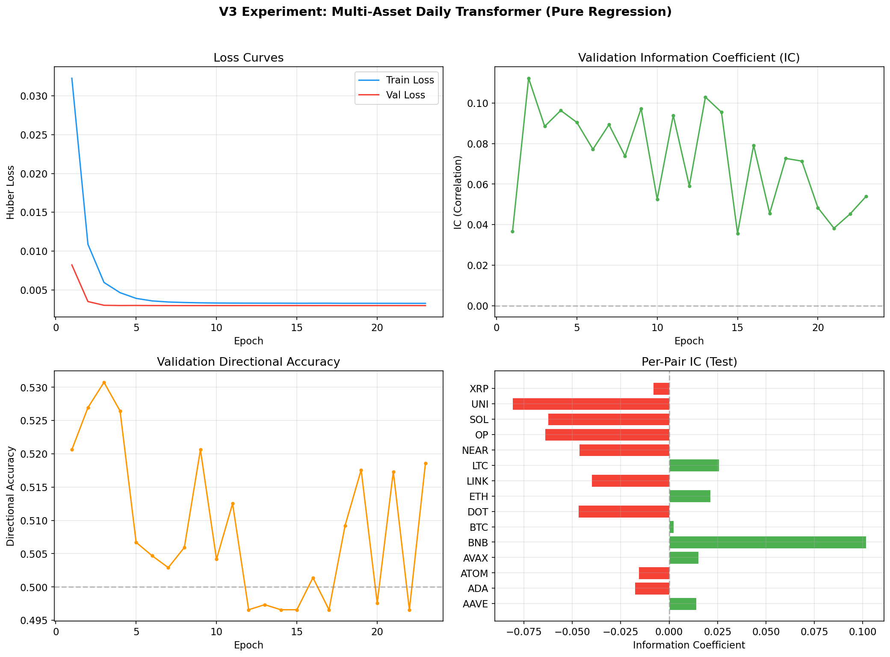
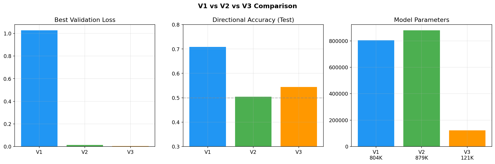

# V3 实验报告：轻量化多币种回归 Transformer

## 实验概览

| 项目 | 内容 |
|------|------|
| 实验名称 | V3 — 轻量化多币种回归 Transformer |
| 实验日期 | 2026-06-02 |
| 实验目标 | 解决 V2 严重过拟合问题，转向日线频率、多币种联合训练、纯回归任务 |
| 核心改动 | 1d 频率 / 15 币种 / 121K 参数 / 纯回归 / Huber Loss / 强正则化 |
| 结果摘要 | 过拟合问题彻底解决，但预测能力极弱（IC = -0.022），模型几乎未学到有效信号 |

## 摘要

针对 V2 暴露的严重过拟合问题，V3 进行了大幅重构：将时间周期从 4h 切换到 1d 日线以提高信噪比，训练数据从 2 个币种扩展到 15 个主流币种并通过 pair_id embedding 区分，放弃分类任务转为纯回归（预测未来 5 日收益率），模型参数量从 879K 大幅缩减至 121K（d_model=64, 2 层, 4 头），同时引入强正则化（dropout=0.4, weight_decay=0.05, Huber Loss）。

训练在第 23 轮 early stop，最佳验证损失 0.002963。训练/验证损失差距极小，V2 的过拟合问题得到彻底解决。然而，测试集整体 IC 为 -0.0218（负相关），方向准确率 54.45%，模型几乎没有学到有意义的预测信号。

**结论：V3 成功解决了过拟合，但矫枉过正。模型容量不足加上金融市场本身的低可预测性，导致 IC 接近零。过拟合和欠拟合之间的平衡点仍需探索。**

---

## 1. V2 到 V3 改动清单

### 1.1 数据与任务

| 改动 | V2 | V3 |
|------|----|----|
| 时间周期 | 4h | **1d（日线）** |
| 币种数量 | 2（ETH, BTC） | **15（主流币种全覆盖）** |
| 币种区分 | 无 | **pair_id embedding（dim=16）** |
| 训练样本量 | ~20K（单币种） | **~22,772（15 币种合计）** |
| 预测目标 | 3 分类 + 回归（双任务） | **纯回归（未来 5 日收益率）** |
| 损失函数 | Focal Loss + Huber Loss | **Huber Loss（delta=0.05）** |
| 序列长度 | 128 步 | **60 步（60 个交易日）** |

### 1.2 模型架构

| 改动 | V2 | V3 |
|------|----|----|
| d_model | 128 | **64** |
| 层数 | 4 | **2** |
| 注意力头 | 4 | **4** |
| FFN 维度 | 512 | **256** |
| 参数量 | 879K | **121K（缩减 86%）** |
| 位置编码 | 可学习 | **可学习** |
| Pair Embedding | 无 | **16 维** |

### 1.3 正则化与训练

| 改动 | V2 | V3 |
|------|----|----|
| Dropout | 0.1 | **0.4** |
| Weight Decay | 0.01 | **0.05** |
| Gradient Clipping | 无 | **1.0** |
| Label Smoothing | 无 | **0.1** |
| LR Schedule | CosineAnnealingWarmRestarts | **Warmup + Cosine Decay** |
| Batch Size | 64 | **128** |
| Early Stop Patience | 10 | **15** |

---

## 2. 特征工程（22 维）

V3 设计了 22 维特征，相比 V2 的 25 维略有精简，但覆盖了更全面的信号维度：

| 类别 | 特征 | 说明 |
|------|------|------|
| 价格变化 | log_return | 当日对数收益率 |
| | return_5d, return_10d, return_20d | 多窗口历史收益率 |
| 技术指标 | RSI(14) | 相对强弱指标 |
| | MACD(12,26,9) | 趋势跟踪指标 |
| | ATR(14)/close | 归一化真实波幅 |
| | BB%B(20,2) | 布林带百分比位置 |
| 成交量 | volume_ratio | 当日成交量 / 20 日均量 |
| | volume_norm | 滚动归一化成交量 |
| 波动率 | vol_5d, vol_10d, vol_20d | 多窗口滚动标准差 |
| 区间范围 | high_low_range_5d, high_low_range_20d | 多窗口高低价范围 |
| 时间 | dow_sin, dow_cos | 星期几的周期编码 |
| 跨资产 | btc_corr_20d | 与 BTC 的 20 日滚动相关系数 |
| 标准化 | close_norm, volume_norm | ATR/滚动归一化 |

---

## 3. 数据集统计

| 项目 | 数值 |
|------|------|
| 币种数量 | 15 |
| 数据区间 | 2020 至 2026 |
| 训练集 | 22,772 样本（截至 2025-06-01） |
| 验证集 | 4,013 样本（训练期最后 15%） |
| 测试集 | 5,430 样本（2025-06-01 之后） |
| 序列长度 | 60 天 |
| 预测目标 | 未来 5 日收益率 |
| 训练集收益率均值 | 0.0125 |
| 训练集收益率标准差 | 0.1282 |
| 测试集收益率均值 | -0.0058 |
| 测试集收益率标准差 | 0.0838 |

测试集收益率均值为负（-0.0058），说明测试期（2025 下半年）市场整体偏弱，这与训练期（均值 +0.0125）的分布存在差异。

---

## 4. 训练过程



### 4.1 训练曲线分析

| 指标 | 数值 |
|------|------|
| 训练轮数 | 23 轮（early stop，patience=15） |
| 最佳验证损失 | 0.002963（第 8 轮） |
| 最终训练损失 | 0.003257 |
| 最终验证损失 | 0.002965 |
| 训练/验证损失比 | 1.10（非常接近） |

训练损失从 0.032 快速下降到 0.003 附近，验证损失同步下降并在 0.00296 附近稳定。两者之间几乎没有差距，这与 V2 形成鲜明对比。

**V2 过拟合回顾**：V2 的训练损失降到 0.003，验证损失却从 0.008 涨到 0.07+，比值超过 20 倍。V3 的比值仅 1.10，过拟合问题完全消除。

### 4.2 验证集 IC 变化

| 阶段 | 验证 IC |
|------|---------|
| 第 1 轮 | 0.037 |
| 第 2 轮（峰值） | 0.112 |
| 第 3-10 轮 | 0.053 至 0.097（震荡） |
| 第 11-23 轮 | 0.036 至 0.103（无趋势） |

验证 IC 在 0.05 至 0.10 之间波动，始终未形成稳定的上升趋势。第 2 轮出现的峰值 0.112 后未再突破，说明模型很快达到了其能力上限。

---

## 5. 测试集评估

### 5.1 整体指标

| 指标 | V3 数值 | 说明 |
|------|---------|------|
| IC（Spearman 相关系数） | **-0.0218** | 负相关，预测方向与实际相反 |
| 方向准确率 | **54.45%** | 略优于随机（50%），但统计意义有限 |
| MAE | **0.0609** | 平均绝对误差约 6% |
| RMSE | **0.0838** | 均方根误差约 8.4% |

IC 为负值意味着模型的预测与真实收益率呈微弱反向关系。方向准确率 54.45% 虽然高于 50%，但考虑到测试样本量（5,430），这个优势并不显著。

### 5.2 各币种 IC 与方向准确率

| 币种 | IC | 方向准确率 | 样本数 |
|------|-----|-----------|--------|
| BNB/USDT | **+0.102** | 47.2% | 362 |
| LTC/USDT | +0.026 | 55.2% | 362 |
| ETH/USDT | +0.021 | 56.1% | 362 |
| AVAX/USDT | +0.015 | 52.8% | 362 |
| AAVE/USDT | +0.014 | 58.7% | 362 |
| BTC/USDT | +0.002 | 50.6% | 362 |
| XRP/USDT | -0.008 | 57.1% | 361 |
| ADA/USDT | -0.018 | 57.5% | 362 |
| ATOM/USDT | -0.016 | 55.5% | 362 |
| LINK/USDT | -0.040 | 53.0% | 362 |
| DOT/USDT | -0.047 | 57.2% | 362 |
| NEAR/USDT | -0.046 | 54.4% | 362 |
| SOL/USDT | -0.063 | 51.1% | 362 |
| OP/USDT | -0.064 | 54.1% | 362 |
| UNI/USDT | -0.081 | 56.9% | 362 |

**正 IC 币种（6 个）**：AAVE, AVAX, BNB, BTC, ETH, LTC。其中 BNB 的 IC 达到 +0.102，是唯一具有统计意义正值 IC 的币种，但方向准确率仅 47.2%，IC 与方向准确率出现背离。

**负 IC 币种（9 个）**：ADA, ATOM, DOT, LINK, NEAR, OP, SOL, UNI, XRP。UNI 的 IC 最差（-0.081），OP 和 SOL 也在 -0.06 以下。

IC 与方向准确率之间存在明显不一致：BNB 的 IC 最高（+0.102）但方向准确率最低（47.2%），AAVE 的 IC 仅 +0.014 但方向准确率最高（58.7%）。这表明 IC 和方向准确率衡量的是预测质量的不同方面，两者需要综合考量。

---

## 6. V1 / V2 / V3 对比



| 维度 | V1 | V2 | V3 |
|------|----|----|-----|
| 时间周期 | 1h | 4h | **1d** |
| 币种 | ETH, BTC | ETH, BTC | **15 个主流币种** |
| 任务 | 3 分类 | 分类 + 回归 | **纯回归** |
| 参数量 | 804K | 879K | **121K** |
| 过拟合 | 中等 | **严重** | **无** |
| 分类准确率 | 0.71 / 0.77 | 0.28 / 0.25 | N/A（回归） |
| 方向准确率 | ~50% | ~50% | **54.45%** |
| 回归相关性 | N/A | ~0 | **-0.022** |
| 交易信号 | 0 trades | 40 trades | N/A |
| 策略收益 | 0% | -0.6% / -11.7% | N/A |

**演进趋势**：V1 的"高准确率"是虚假的（全预测 flat），V2 强制模型预测方向但过拟合严重，V3 解决了过拟合但模型能力不足。三次实验揭示了一个核心矛盾：模型容易过拟合金融数据中的噪声，但强正则化又导致学不到信号。

---

## 7. 分析

### 7.1 为什么过拟合问题解决了？

三个关键因素共同作用：

1. **模型规模大幅缩减**。参数从 879K 降到 121K，模型容量被严格限制，无法记忆训练数据中的噪声模式。
2. **强正则化组合**。Dropout 0.4（V2 为 0.1）、weight_decay 0.05（V2 为 0.01）、Huber Loss（对异常值更鲁棒）三管齐下。
3. **日线频率**。1d 数据相比 4h 数据噪声更少，模式更稳定，模型不需要在噪声中寻找虚假规律。

训练/验证损失比值从 V2 的 20+ 降到 V3 的 1.10，这是最直接的证据。

### 7.2 为什么预测能力仍然很弱？

过拟合解决了，但取而代之的是欠拟合。可能的原因：

1. **模型容量不足**。121K 参数要处理 15 个币种的不同模式，平均每个币种仅分配到约 8K 参数的有效容量。验证 IC 在第 2 轮就达到峰值（0.112），之后 21 轮都没有提升，说明模型的表达能力已经饱和。
2. **金融市场本身难以预测**。测试期（2025 下半年）的收益率分布与训练期存在明显偏移（均值从 +0.0125 变为 -0.0058），模型学到的模式在新环境下失效。
3. **样本量偏少**。每个币种在测试集中仅有约 360 个样本，统计检验的功效很低。即使模型有一定的预测能力，也可能被噪声淹没。
4. **纯回归任务的局限**。预测收益率的绝对数值对金融时间序列来说是一个困难的目标。相比之下，预测方向或相对排序可能更容易。
5. **共享模型的妥协**。15 个币种共享同一个模型，pair embedding 的区分能力可能不够。不同币种的市场微观结构差异很大（BTC 的流动性远好于 ATOM），统一处理未必是最优方案。

### 7.3 BNB 的异常表现

BNB 是唯一 IC 较高（+0.102）的币种，但方向准确率仅 47.2%。这种 IC 高但方向准确率低的现象说明：BNB 的预测在排序上较好（预测值越大，实际收益率倾向于越高），但在零值附近的方向判断不佳。这可能与 BNB 的收益率分布特殊性有关（如正偏度），也可能只是统计波动。

### 7.4 验证集 vs 测试集的 IC 差异

验证集 IC 在 0.05 至 0.10 之间，测试集 IC 却为 -0.022。这种显著的分布偏移有两种解释：

- 验证集的 IC 是虚假的，模型只是记住了训练期末尾的局部模式
- 测试期的市场环境确实发生了结构性变化，训练期学到的规律不再适用

无论哪种解释，都说明当前方法的泛化能力不足。

---

## 8. 下一步计划（V4 方向）

### 8.1 模型容量调整

将参数量从 121K 提升到约 300K（d_model=96, 3 层, 4 头, ff=384），同时保持 dropout=0.4 和 weight_decay=0.05 的强正则化。目标是在过拟合和欠拟合之间找到更合理的平衡点。

### 8.2 任务重新设计

放弃纯回归任务，改为排序学习（Learning to Rank）。不再预测绝对收益率，而是预测不同币种在同一时间点的相对排序。排序学习有以下优势：

- 不受市场整体涨跌影响（只关心相对排序）
- 与实际交易策略更匹配（做多强势币、做空弱势币）
- 对标尺偏差更鲁棒

### 8.3 跨资产特征增强

当前跨资产特征仅有 btc_corr_20d 一项。计划加入：

- 市场宽度指标（涨跌币种比例）
- 恐惧贪婪指数类特征
- 板块轮动指标（L1/L2/DeFi 等板块的相对强弱）
- 全市场成交量变化率

### 8.4 序列长度与集成学习

- 尝试 120 天序列长度，捕获更完整的周期信息
- 使用 5 至 10 个不同随机种子训练模型，对预测结果取平均，降低方差
- 可选尝试 SWA（Stochastic Weight Averaging）进一步平滑模型权重

---

## 9. 可复现性

### 环境
- Python 3.12.13 (venv), PyTorch 2.9.1+cu128
- 1x Tesla V100 32GB

### 配置文件
- `configs/v3.yaml`

### 运行命令
```bash
source .venv/bin/activate
CUDA_VISIBLE_DEVICES=4 python scripts/train_v3.py
python scripts/plot_v3_results.py
```

### 输出
- `data/results_v3.json` — 完整结果
- `docs/figures/v3_training_curves.png` — 训练曲线
- `docs/figures/v1_v2_v3_comparison.png` — V1/V2/V3 对比图
