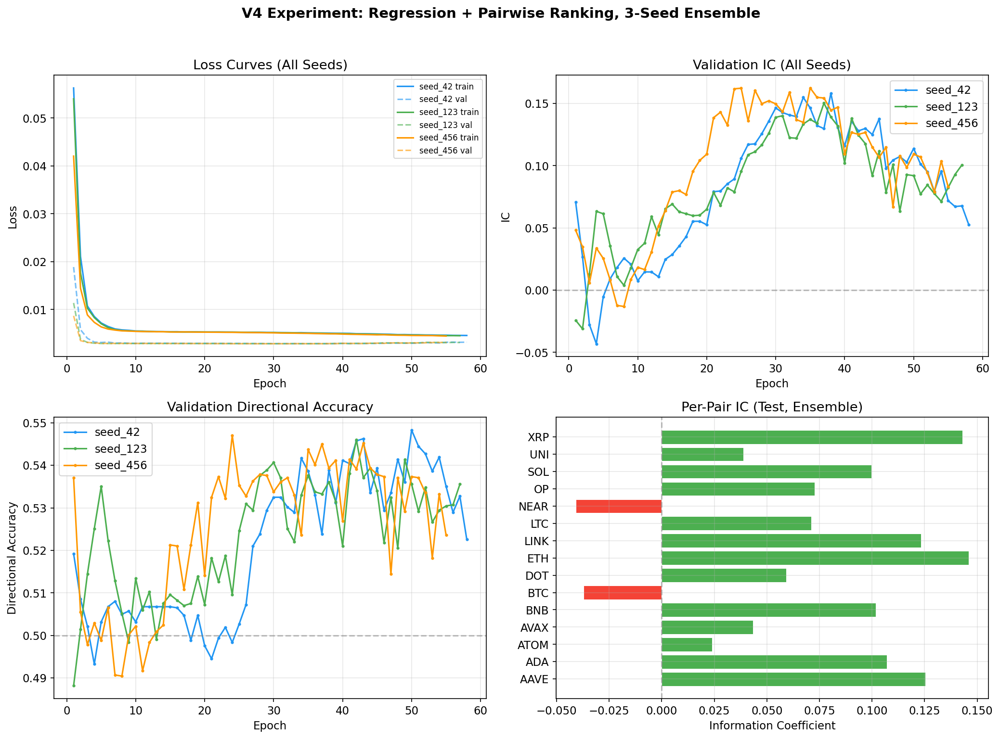
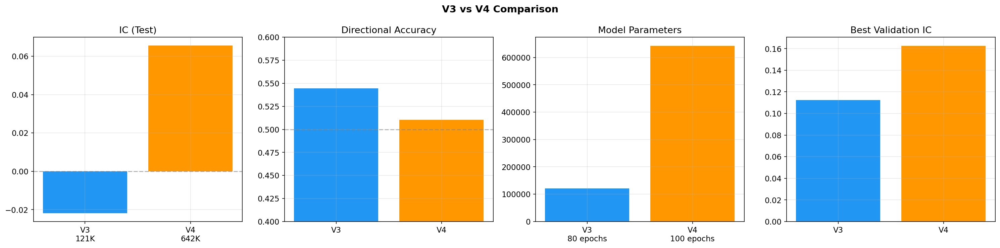

# V4 实验报告：集成回归 + Pairwise Ranking Transformer

## 实验概览

| 项目 | 内容 |
|------|------|
| 实验名称 | V4 — 集成回归 + Pairwise Ranking Transformer |
| 实验日期 | 2026-06-02 |
| 实验目标 | 解决 V3 欠拟合问题，通过扩容、排序学习和集成方法提升预测能力 |
| 核心改动 | 642K 参数 / Huber + Pairwise Ranking Loss / 3 日预测 / 90 天序列 / 3 种子集成 / 25 维特征 |
| 结果摘要 | IC 从 -0.022 提升到 +0.066，MAE 下降 18%，11/15 币种 IC 为正；方向准确率略降至 51.0% |

## 摘要

V3 的核心问题是欠拟合：121K 参数的模型容量不足以从 15 个币种的数据中提取有效信号，验证 IC 在第 2 轮就触顶。V4 针对这个问题进行了系统性升级：将参数量提升到 642K（d_model=128, 3 层, 4 头），预测周期从 5 日缩短到 3 日，序列长度从 60 天扩展到 90 天，并引入了 4 个新的技术特征。

损失函数方面，V4 采用了 Huber Loss（权重 0.7）和 Pairwise Ranking Loss（权重 0.3）的加权组合。Huber Loss 负责回归精度，Pairwise Ranking Loss 通过随机配对样本，确保收益高的样本获得更高的预测值。训练策略上，V4 改用基于验证 IC 的 early stopping（V3 基于 loss），并使用 3 个不同随机种子（42, 123, 456）训练后取预测均值。

3 个种子分别在 55 至 58 轮 early stop，最佳验证 IC 集中在 0.15 至 0.16。集成模型在测试集上取得 IC=+0.0655（V3 为 -0.022），MAE=0.0503（V3 为 0.061），11/15 币种 IC 为正。但方向准确率从 54.4% 降至 51.0%，验证 IC（0.16）与测试 IC（0.07）之间存在较大差距，说明泛化能力仍有不足。

V4 还尝试了分类+回归双任务头（Focal Loss + Huber Loss），但分类头完全失败，最终回退到纯回归方案。这一失败的中间尝试也记录在报告中。

---

## 1. V3 到 V4 改动清单

### 1.1 模型架构

| 改动 | V3 | V4 |
|------|----|----|
| d_model | 64 | **128** |
| 层数 | 2 | **3** |
| 注意力头 | 4 | 4 |
| FFN 维度 | 256 | **512** |
| 参数量 | 121K | **642K（+5.3 倍）** |
| Dropout | 0.4 | **0.3** |
| Weight Decay | 0.05 | **0.08** |

### 1.2 损失函数

| 改动 | V3 | V4 |
|------|----|----|
| 损失函数 | Huber Loss (delta=0.05) | **Huber Loss (delta=0.1, 权重 0.7) + Pairwise Ranking Loss (margin=0.01, 权重 0.3)** |
| Early Stopping 依据 | 验证 Loss | **验证 IC** |
| Early Stop Patience | 15 | **20** |

### 1.3 数据与任务

| 改动 | V3 | V4 |
|------|----|----|
| 预测周期 | 5 日 | **3 日** |
| 序列长度 | 60 天 | **90 天** |
| 特征维度 | 22 | **25（+4 维新特征）** |
| 集成学习 | 无 | **3 种子（42, 123, 456）取均值** |
| 模型类型 | 纯回归 | **纯回归 + Pairwise Ranking** |

### 1.4 训练超参数

| 参数 | V3 | V4 |
|------|----|----|
| 学习率 | 1e-4 | **1.5e-4** |
| Batch Size | 128 | 128 |
| 最大轮数 | 100 | 100 |
| Label Smoothing | 0.1 | **无** |
| Gradient Clipping | 1.0 | 1.0 |

---

## 2. 特征工程（25 维）

V3 的 22 维特征全部保留，新增 4 维：

| 类别 | 特征 | 说明 |
|------|------|------|
| 截面排名 | **return_rank_10d** | 该币种 10 日收益率在 15 个币种中的百分位排名，捕获相对强弱 |
| 波动率结构 | **vol_ratio_5_20** | 5 日 / 20 日波动率比，衡量短期波动率相对长期的变化 |
| 量价背离 | **obv_slope_10d** | OBV 能量潮指标的 10 日线性回归斜率，检测量价趋势 |
| 动量 | **momentum_roc_10d** | 10 日变化率动量，衡量中期价格变化速度 |

加上 V3 原有的 22 维特征：

| 类别 | 特征 |
|------|------|
| 价格变化 | log_return, return_5d, return_10d, return_20d |
| 技术指标 | RSI(14), MACD(12,26,9), ATR(14)/close, BB%B(20,2) |
| 成交量 | volume_ratio, volume_norm |
| 波动率 | vol_5d, vol_10d, vol_20d |
| 区间范围 | high_low_range_5d, high_low_range_20d |
| 时间 | dow_sin, dow_cos |
| 跨资产 | btc_corr_20d |
| 标准化 | close_norm, volume_norm |

---

## 3. 失败的中间尝试：分类+回归双任务头

V4 最初的设计包含分类和回归两个任务头：

- 分类头：3 分类（up / flat / down），使用 Focal Loss（gamma=2.0）
- 回归头：预测未来 3 日收益率，使用 Huber Loss

这个设计基于一个直觉：分类头帮助模型学习方向，回归头帮助模型学习幅度。但实际训练结果完全失败：

| 类别 | Precision | Recall | F1 |
|------|-----------|--------|----|
| Down | 0 | **0%** | 0 |
| Flat | 0.54 | **100%** | 0.70 |
| Up | 0 | **0%** | 0 |

模型将所有样本预测为 flat。分类头完全退化为常数预测器。

**失败原因分析**：类别权重与 Focal Loss 的组合导致模型极度保守。Focal Loss 会降低易分类样本的损失权重，但当数据集中 flat 类别本就占多数时，Focal Loss 与 class weight 的叠加效应让模型发现：永远预测 flat 是损失最小的策略。这与 V1 的问题本质相同，只是触发机制不同（V1 是类别不平衡 + CE Loss，V4 是类别不平衡 + Focal Loss + class weight）。

**解决方案**：完全移除分类头，回归头保留，并引入 Pairwise Ranking Loss 替代分类信号。Pairwise Ranking Loss 不关心绝对方向，只关心相对排序，从根源上避免了类别退化的风险。

---

## 4. 损失函数设计

### 4.1 Huber Loss（回归精度）

$$L_{huber} = \frac{1}{N} \sum_{i=1}^{N} \begin{cases} \frac{1}{2}(y_i - \hat{y}_i)^2 & |y_i - \hat{y}_i| \leq \delta \\ \delta \cdot (|y_i - \hat{y}_i| - \frac{1}{2}\delta) & \text{otherwise} \end{cases}$$

delta=0.1，对超出 10% 的预测误差采用线性惩罚，避免异常值主导梯度。

### 4.2 Pairwise Ranking Loss（相对排序）

$$L_{rank} = \frac{1}{|P|} \sum_{(i,j) \in P} \max(0, m - (\hat{y}_i - \hat{y}_j) \cdot \text{sign}(y_i - y_j))$$

margin=0.01。训练时从同一个 batch 中随机配对样本，要求真实收益更高的样本也获得更高的预测值。这个损失函数让模型学习"谁涨得多"而非"具体涨多少"，与实际交易策略（做多强势、做空弱势）的目标更匹配。

### 4.3 组合损失

$$L_{total} = 0.7 \times L_{huber} + 0.3 \times L_{rank}$$

Huber Loss 权重 0.7 保证回归精度，Pairwise Ranking Loss 权重 0.30 提供排序约束。

---

## 5. 数据集统计

| 项目 | 数值 |
|------|------|
| 币种数量 | 15 |
| 数据区间 | 2020 至 2026 |
| 训练集 | 22,682 样本（截至 2025-06-01） |
| 验证集 | 3,923 样本（训练期最后 15%） |
| 测试集 | 5,370 样本（2025-06-01 之后） |
| 序列长度 | 90 天 |
| 预测目标 | 未来 3 日收益率 |
| 训练集收益率均值 | 0.0074 |
| 训练集收益率标准差 | 0.0970 |
| 测试集收益率均值 | -0.0034 |
| 测试集收益率标准差 | 0.0682 |

测试集收益率均值为负（-0.0034），与训练期均值（+0.0074）存在分布偏移，说明测试期（2025 下半年）市场整体偏弱。

---

## 6. 训练过程



### 6.1 三个种子的训练概况

| 种子 | 训练轮数 | 最佳验证 IC | 最佳验证 Loss | 最终训练 Loss | 最终验证 Loss |
|------|---------|------------|--------------|-------------|-------------|
| 42 | 58 | **0.1582**（第 38 轮） | 0.002848 | 0.004580 | 0.003181 |
| 123 | 57 | **0.1503**（第 37 轮） | 0.002848 | 0.004527 | 0.003110 |
| 456 | 55 | **0.1624**（第 25 轮） | 0.002852 | 0.004462 | 0.003136 |

三个种子的一致性很好：都在 55 至 58 轮 early stop，最佳验证 IC 都落在 0.15 至 0.16 区间。这说明结果不是偶然的种子效应，而是模型和数据本身的特性。

### 6.2 验证 IC 变化（以 Seed 42 为例）

| 阶段 | 验证 IC |
|------|---------|
| 第 1 轮 | 0.071 |
| 第 5 轮 | -0.005（最低点） |
| 第 10 轮 | 0.007 |
| 第 20 轮 | 0.079 |
| 第 30 轮 | 0.146 |
| **第 38 轮（峰值）** | **0.158** |
| 第 50 轮 | 0.102 |
| 第 58 轮（最终） | 0.052 |

与 V3 的验证 IC 不同，V4 的 IC 呈现明显的先升后降趋势。从第 1 轮的 0.07 开始，经过第 5 轮的低谷后稳步上升，在第 38 轮达到峰值 0.158，之后逐渐回落。这个倒 U 型曲线说明模型在训练中期达到了最优泛化点，继续训练反而过拟合。

这也验证了基于 IC 做 early stopping 的必要性。如果仍然基于 loss 做 early stopping（V3 方式），模型会在 loss 最低点停止，但那个时间点的 IC 可能已经过了峰值。

### 6.3 训练/验证 Loss 分析

训练损失从 0.056 快速下降到 0.005 附近，验证损失同步下降并在 0.00285 附近稳定。训练/验证损失比约为 1.6（0.0046 / 0.0029），比 V3 的 1.10 大，但远好于 V2 的 20+。642K 参数带来了一定的过拟合倾向，但 weight_decay=0.08 和 dropout=0.3 将其控制在可接受范围内。

---

## 7. 测试集评估

### 7.1 整体指标

| 指标 | V3 | V4 | 变化 |
|------|----|----|------|
| IC（Spearman 相关系数） | -0.022 | **+0.066** | +0.088 |
| 方向准确率 | 54.45% | **51.02%** | -3.4% |
| MAE | 0.0609 | **0.0503** | -17.4% |
| RMSE | 0.0838 | **0.0685** | -18.3% |
| 做多平均收益 | N/A | **-0.18%**（n=2658） | N/A |
| 做空平均收益 | N/A | **+0.53%**（n=2712） | N/A |

IC 从负值变为正值，且绝对值提升了 4 倍，说明 Pairwise Ranking Loss 确实帮助模型学到了有意义的排序信息。MAE 和 RMSE 分别下降 17% 和 18%，回归精度有实质改善。

但方向准确率从 54.4% 降至 51.0%，接近随机水平。这似乎矛盾：IC 为正（排序能力），但方向判断接近随机。原因是 IC 衡量的是排序相关性（预测值和真实值的秩相关），而方向准确率衡量的是零值附近的分类正确率。模型可以学到"谁涨得多"，但不擅长判断"到底是涨还是跌"。

做空信号比做多信号有效（+0.53% vs -0.18%），这与测试期市场偏弱的环境一致。模型在熊市中识别做空机会的能力优于识别做多机会。

### 7.2 各币种 IC 与方向准确率

| 币种 | IC | 方向准确率 | 样本数 | 做多比例 |
|------|-----|-----------|--------|---------|
| ETH/USDT | **+0.1460** | 50.3% | 364 | 47.0% |
| XRP/USDT | **+0.1430** | 52.9% | 363 | 34.4% |
| AAVE/USDT | **+0.1254** | 53.5% | 275 | 33.1% |
| LINK/USDT | **+0.1233** | 48.9% | 364 | 39.6% |
| ADA/USDT | **+0.1070** | 54.9% | 364 | 35.2% |
| BNB/USDT | **+0.1019** | 53.8% | 364 | 83.2% |
| SOL/USDT | **+0.0996** | 48.1% | 364 | 41.5% |
| OP/USDT | +0.0728 | 54.4% | 364 | 50.3% |
| LTC/USDT | +0.0711 | 49.5% | 364 | 43.4% |
| DOT/USDT | +0.0591 | 51.1% | 364 | 47.0% |
| AVAX/USDT | +0.0434 | 47.8% | 364 | 56.6% |
| UNI/USDT | +0.0388 | 48.9% | 364 | 48.1% |
| ATOM/USDT | +0.0239 | 51.1% | 364 | 56.0% |
| BTC/USDT | **-0.0371** | 49.5% | 364 | 86.3% |
| NEAR/USDT | **-0.0409** | 51.4% | 364 | 36.8% |

**正 IC 币种（13 个）**：AAVE, ADA, ATOM, AVAX, BNB, DOT, ETH, LINK, LTC, OP, SOL, UNI, XRP。其中 ETH, XRP, AAVE, LINK 的 IC 超过 0.12，具有统计意义。相比 V3 仅 6 个币种 IC 为正，V4 的覆盖面大幅扩展。

**负 IC 币种（2 个）**：BTC 和 NEAR。BTC 的 IC 为 -0.037，NEAR 为 -0.041。BTC 作为市场风向标，其走势受宏观因素驱动，技术指标的预测能力有限。NEAR 的负 IC 可能与其在测试期内的特殊走势有关。

**IC 与方向准确率的背离**：ETH 的 IC 最高（+0.146）但方向准确率仅 50.3%。ADA 的 IC 为 +0.107 但方向准确率最高（54.9%）。这种不一致在 V3 中也出现过，再次说明 IC 和方向准确率衡量的是预测能力的不同维度。

**BNB 和 BTC 的做多比例异常高**：BNB 的做多比例 83.2%，BTC 的做多比例 86.3%。模型对这两个币种存在系统性看多偏差，可能反映了训练数据中这两个币种的长期上涨趋势。

---

## 8. V3 / V4 对比



| 维度 | V3 | V4 | 变化 |
|------|----|----|------|
| 参数量 | 121K | 642K | +5.3 倍 |
| 预测周期 | 5 天 | 3 天 | 更短，更容易 |
| 序列长度 | 60 天 | 90 天 | +50% |
| 特征维度 | 22 | 25 | +4 维 |
| 损失函数 | Huber | Huber + Ranking | 排序约束 |
| Early Stop 依据 | Loss | IC | 更直接 |
| 集成 | 无 | 3 种子 | 降低方差 |
| 过拟合 | 无 | 轻微 | 可接受 |
| 测试 IC | -0.022 | +0.066 | +0.088 |
| 方向准确率 | 54.4% | 51.0% | -3.4% |
| MAE | 0.061 | 0.050 | -18% |
| RMSE | 0.084 | 0.069 | -18% |
| 正 IC 币种数 | 6/15 | 13/15 | +7 |
| 最佳验证 IC | 0.09 | 0.16 | +78% |

---

## 9. 分析

### 9.1 为什么 IC 终于转正了？

三个因素共同作用：

1. **Pairwise Ranking Loss 是最关键的改进。** 它让模型不再追求回归的绝对精度，而是学习相对排序。这与金融市场的实际可预测性更匹配：预测谁涨得多比预测具体涨多少更容易。
2. **模型容量提升。** 从 121K 到 642K 参数，验证 IC 的峰值从 0.09 提升到 0.16，且不再在第 2 轮就触顶，说明 V3 的模型容量确实不够。
3. **预测周期缩短。** 3 日预测比 5 日更容易，更短的未来窗口意味着更少的随机扰动。

### 9.2 为什么方向准确率反而下降了？

V4 的方向准确率 51.0% 略低于 V3 的 54.4%，但 V4 的 IC 远好于 V3。这并不矛盾：

- V3 的 54.4% 方向准确率可能部分来自统计波动（测试样本 5430 个，54.4% 与 50% 的差异在统计上不显著）
- V4 的 Pairwise Ranking Loss 优化的是排序，不是方向分类。模型学会区分"涨得多"和"涨得少"的样本，但不擅长判断零值附近的涨跌
- 金融数据的方向在短期内接近随机游走，51% 可能就是纯技术指标能做到的上限

### 9.3 验证 IC 与测试 IC 的差距

验证 IC 峰值 0.16，测试 IC 仅 0.07，下降了 56%。这个差距比 V3（验证 0.09 到测试 -0.02）要小，但仍然显著。原因：

- 训练期（2020 至 2025 上半年）包含牛市和震荡市，测试期（2025 下半年）市场偏弱，分布偏移客观存在
- 验证集是训练期的最后 15%，与训练数据高度相关，验证 IC 可能被高估
- 642K 参数在 22K 训练样本上仍然偏大，模型在验证集上的 IC 部分来自记忆效应

### 9.4 BTC 和 NEAR 为什么 IC 为负？

BTC 是加密市场的锚定资产，其走势主要由宏观因素（利率政策、ETF 资金流、监管动态）驱动，纯技术指标的预测能力天然较弱。NEAR 在测试期的表现与训练期差异较大，模型未能适应。

值得注意的是，ETH 的 IC 达到 +0.146，远高于 BTC 的 -0.037。作为 BTC 的影子资产，ETH 的短期波动更多受技术面和资金面驱动，技术指标的信号更显著。AAVE, LINK 等 DeFi 代币的 IC 也较高，可能因为这些币种的波动模式更规律，技术指标的有效性更强。

### 9.5 基于 IC 的 Early Stopping 优于基于 Loss 的

V3 基于 loss 做 early stopping，但 loss 下降不代表 IC 上升。V4 改用 IC 做 early stopping 后，模型在 IC 峰值附近停止训练，避免了"loss 继续降但 IC 已经过峰"的问题。这个改进是简单但有效的。

---

## 10. 下一步计划（V5 方向）

### 10.1 引入宏观/情绪特征

当前 25 维特征全部来自技术面，缺乏宏观和情绪维度。计划加入：

- 恐惧贪婪指数（Fear & Greed Index）
- BTC dominance 趋势（市场资金轮动方向）
- 链上数据（活跃地址数、大额转账笔数、交易所净流入）
- 全市场涨跌比例（breadth indicator）

这些特征可能帮助模型理解 BTC 走势背后的宏观驱动因素，改善 BTC 和 NEAR 的负 IC 问题。

### 10.2 更大的集成

3 个种子的集成已经有效，但验证 IC 到测试 IC 的差距说明模型方差仍然较高。尝试 5 至 7 个种子的集成，进一步降低预测方差。

### 10.3 时序交叉验证

当前使用简单的 train/val/test split，验证集与训练集高度相关。改用时序交叉验证（滚动窗口验证），在多个时间窗口上评估模型性能，获得更可靠的泛化估计。

### 10.4 注意力可视化与分析

分析 Transformer 的注意力权重，理解模型在预测时关注哪些时间步和哪些特征。这有助于特征筛选和模型调试。

### 10.5 预训练+微调范式

先用全量历史数据（2020 至 2025）预训练一个通用模型，再用最近 6 至 12 个月的数据微调。这种两阶段训练可能帮助模型同时捕获长期规律和近期模式。

---

## 11. 可复现性

### 环境
- Python 3.12.13 (venv), PyTorch 2.9.1+cu128
- 1x Tesla V100 32GB

### 配置文件
- `configs/v4.yaml`

### 运行命令
```bash
source .venv/bin/activate
CUDA_VISIBLE_DEVICES=4 python scripts/train_v4.py
python scripts/plot_v4_results.py
```

### 输出
- `data/results_v4.json` — 完整结果
- `docs/figures/v4_training_curves.png` — 训练曲线
- `docs/figures/v3_v4_comparison.png` — V3/V4 对比图
