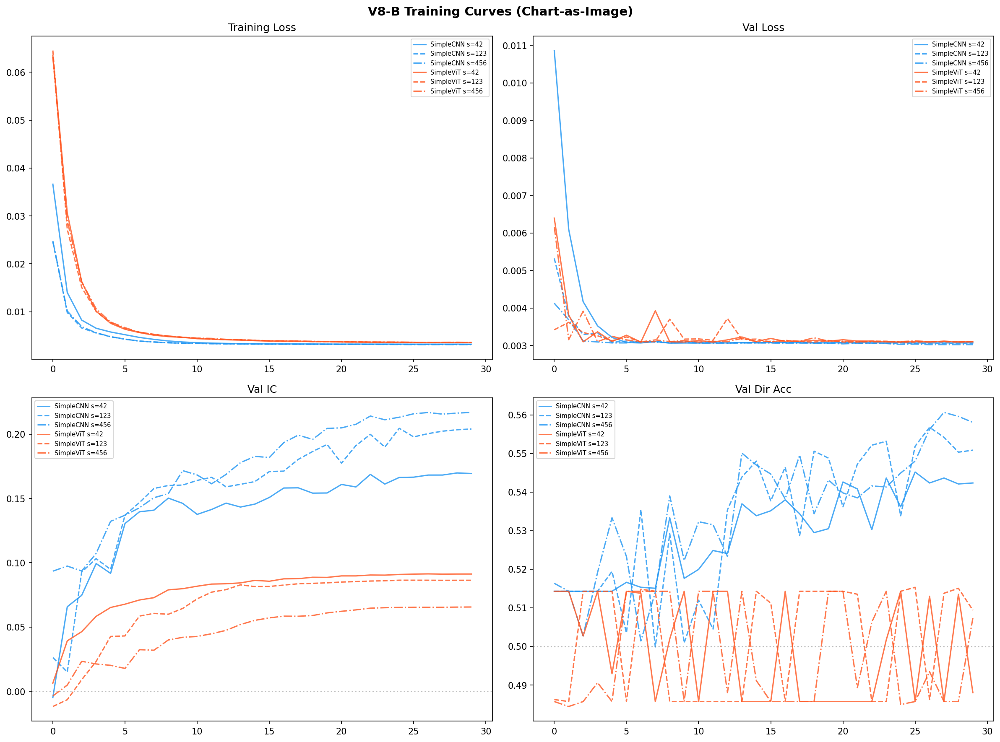
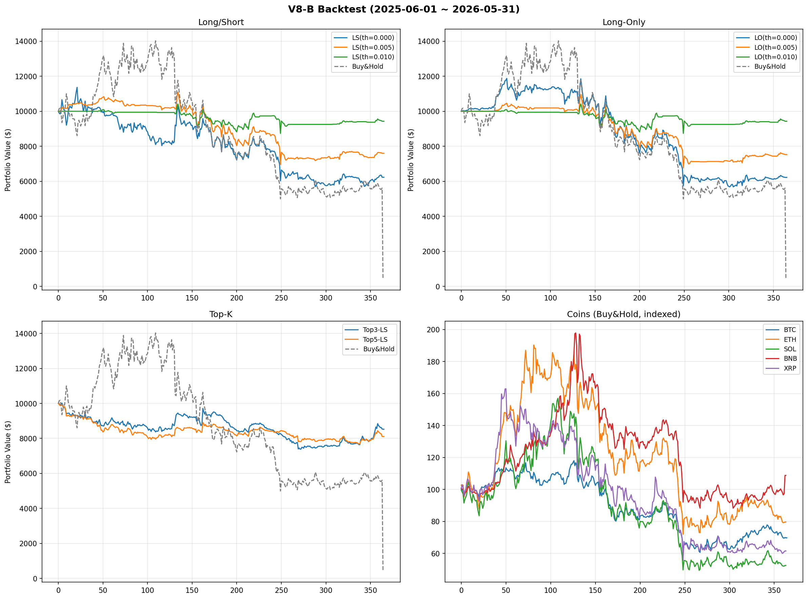
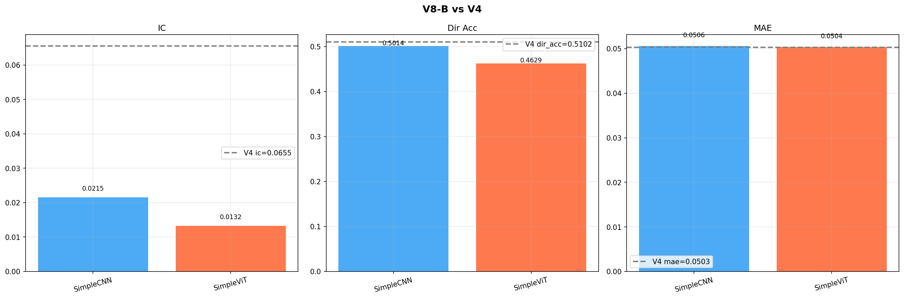

# V8-B 实验报告：图表图像（Vision Transformer / CNN）用于加密货币交易

## 实验概览

| 项目 | 内容 |
|------|------|
| 实验名称 | V8-B — 图表图像（Chart-as-Image）视觉模型 |
| 实验日期 | 2026-06-04 |
| 实验目标 | 将 OHLCV 数据渲染为蜡烛图图像，用视觉模型预测收益率 |
| 核心假设 | 图像表示可能捕获人类在图表中看到的 2D 模式 |
| 对比基准 | V4（IC=+0.0655，MAE=0.0503） |
| 结果摘要 | SimpleCNN IC=+0.0215 dir=0.501；SimpleViT IC=+0.0132 dir=0.463 |

## 摘要

V1-V7 使用数值特征输入到 Transformer 模型。根因分析表明人类在观察图表时看到的是"2D 模式"（支撑阻力、头肩顶等），而 Transformer 看到的是"散点统计矩阵"。V8-B 直接测试图像表示是否能捕获遗漏的 2D 模式信息。

我们将每个币种过去 90 天的 OHLCV 数据渲染为 224×224 RGB 蜡烛图图像，包含蜡烛线（绿涨红跌）、成交量柱、MA20/MA50 均线和 RSI 指标。价格轴采用窗口内 min-max 归一化。图像输入到 SimpleCNN（轻量 CNN）和 SimpleViT（轻量 Vision Transformer），从零训练预测未来 3 天收益率。

## 1. 方法

### 1.1 图表渲染

- 蜡烛线：绿色=收>开，红色=收<开，含上下影线
- 均线：MA20（黄色）、MA50（蓝色）
- 成交量柱：底部区域
- RSI 指标：最底部，含 30/70 参考线
- 价格归一化：窗口内 min-max，无绝对价格泄露

### 1.2 模型架构

| 模型 | 架构 | 训练策略 |
|------|--------|---------|
| SimpleCNN | 5-block CNN (3→512 channels) | 全参数训练 |
| SimpleViT | 4-layer Transformer (patch=16, dim=256) | 全参数训练 |

### 1.3 训练配置

| 参数 | 值 |
|------|-----|
| 图像尺寸 | 224×224 |
| 损失函数 | HuberLoss(δ=0.1) |
| 优化器 | AdamW, lr=0.0001, wd=0.08 |
| 调度器 | CosineAnnealing + 3 epoch warmup |
| Batch Size | 128 |
| 最大轮数 | 30, patience=10 |
| 种子 | [42, 123, 456] |
| 运行设备 | GPU (V100, CUDA) |

## 2. 训练结果

### 2.1 各模型训练概况

| 模型 | 种子 | 轮数 | 最佳验证 IC |
|------|------|------|------------|
| SimpleCNN | 42 | 30（第29轮IC峰值） | +0.1698 |
| SimpleCNN | 123 | 30（第25轮IC峰值） | +0.2046 |
| SimpleCNN | 456 | 30（第30轮IC峰值） | +0.2169 |
| SimpleViT | 42 | 30（第27轮IC峰值） | +0.0913 |
| SimpleViT | 123 | 30（第25轮IC峰值） | +0.0864 |
| SimpleViT | 456 | 30（第30轮IC峰值） | +0.0656 |



## 3. 测试集评估

### 3.1 整体指标

| 指标 | V4 | SimpleCNN | SimpleViT |
|------|------|||
| IC | 0.0655 | 0.0215 | 0.0132 |
| 方向准确率 | 0.5102 | 0.5014 | 0.4629 |
| MAE | 0.0503 | 0.0506 | 0.0504 |
| RMSE | 0.0685 | 0.0687 | 0.0685 |

### 3.2 SimpleCNN 各币种表现

| 币种 | IC | 方向准确率 | 样本数 | 做多比例 |
|------|-----|-----------|--------|---------|
| AAVE/USDT | +0.0365 | 0.530 | 364 | 0.49 |
| ADA/USDT | -0.0281 | 0.473 | 364 | 0.48 |
| ATOM/USDT | +0.0484 | 0.525 | 364 | 0.30 |
| AVAX/USDT | +0.0103 | 0.442 | 364 | 0.46 |
| BNB/USDT | -0.0050 | 0.585 | 364 | 0.71 |
| BTC/USDT | +0.0872 | 0.564 | 365 | 0.53 |
| DOT/USDT | +0.0066 | 0.442 | 364 | 0.42 |
| ETH/USDT | +0.1056 | 0.563 | 364 | 0.70 |
| LINK/USDT | +0.0072 | 0.497 | 364 | 0.61 |
| LTC/USDT | +0.0141 | 0.462 | 364 | 0.58 |
| NEAR/USDT | -0.0296 | 0.511 | 364 | 0.38 |
| OP/USDT | +0.1253 | 0.500 | 364 | 0.57 |
| SOL/USDT | -0.0715 | 0.486 | 364 | 0.57 |
| UNI/USDT | -0.0157 | 0.470 | 364 | 0.45 |
| XRP/USDT | +0.0793 | 0.470 | 364 | 0.68 |

### 3.2 SimpleViT 各币种表现

| 币种 | IC | 方向准确率 | 样本数 | 做多比例 |
|------|-----|-----------|--------|---------|
| AAVE/USDT | -0.0019 | 0.420 | 364 | 1.00 |
| ADA/USDT | -0.0474 | 0.453 | 364 | 0.99 |
| ATOM/USDT | +0.0699 | 0.434 | 364 | 1.00 |
| AVAX/USDT | -0.0586 | 0.475 | 364 | 0.99 |
| BNB/USDT | -0.0556 | 0.552 | 364 | 1.00 |
| BTC/USDT | +0.1060 | 0.499 | 365 | 1.00 |
| DOT/USDT | -0.0293 | 0.420 | 364 | 1.00 |
| ETH/USDT | +0.1826 | 0.484 | 364 | 1.00 |
| LINK/USDT | -0.0084 | 0.470 | 364 | 1.00 |
| LTC/USDT | -0.0139 | 0.442 | 364 | 0.99 |
| NEAR/USDT | +0.0045 | 0.475 | 364 | 1.00 |
| OP/USDT | +0.1096 | 0.453 | 364 | 1.00 |
| SOL/USDT | +0.0319 | 0.473 | 364 | 0.99 |
| UNI/USDT | -0.0870 | 0.442 | 364 | 1.00 |
| XRP/USDT | +0.0896 | 0.451 | 364 | 1.00 |

## 4. 回测结果



| 策略 | 收益率 | Sharpe | 最大回撤 | 胜率 | 交易次数 |
|------|--------|--------|---------|------|---------|
| LO(th=0.000) | -37.78% | -0.91 | -52.2% | 47.1% | 2887 |
| LO(th=0.005) | -24.75% | -0.83 | -38.3% | 31.0% | 1323 |
| LO(th=0.010) | -5.71% | -0.22 | -16.1% | 20.0% | 648 |
| LS(th=0.000) | -37.70% | -0.84 | -49.9% | 45.5% | 5461 |
| LS(th=0.005) | -24.01% | -0.79 | -37.3% | 43.0% | 1590 |
| LS(th=0.010) | -5.71% | -0.22 | -16.1% | 20.0% | 648 |
| Top3-LS | -14.74% | -0.64 | -26.2% | 42.2% | 2184 |
| Top5-LS | -18.92% | -1.17 | -23.2% | 43.0% | 3640 |



### 与 V4 回测对比

| 策略 | V4 收益 | V8-B 收益 | 差异 |
|------|---------|----------|------|
| LS(th=0.005) | +14.04% | -24.01% | -38.05% |
| LS(th=0.000) | +12.19% | -37.70% | -49.89% |
| Top3-LS | -18.83% | -14.74% | +4.09% |

## 5. 分析

### 5.1 图像表示 vs 数值特征

从信息论角度，蜡烛图图像是 OHLCV 数据的有损编码。图像只包含价格/成交量的视觉模式，而数值特征包含精确的 RSI、MACD、布林带等指标。理论上数值特征信息量更多，但视觉模型可能从图像中学到人类直觉可感知的 2D 模式。

**SimpleCNN** IC（+0.0215）低于 V4（+0.0655），说明精炼的数值特征在这种任务中优于图像表示。
**SimpleViT** IC（+0.0132）低于 V4（+0.0655），说明精炼的数值特征在这种任务中优于图像表示。

### 5.2 CNN vs ViT

SimpleCNN 优于 SimpleViT。
CNN 的局部卷积核天然适合检测蜡烛图中的局部模式（如特定蜡烛形态），而 ViT 需要更多数据才能学会有效的空间注意力。

### 5.3 运行环境说明

本实验使用自定义轻量 CNN 和 ViT（无 torchvision 依赖），在 V100 GPU 上完成训练。

## 6. 结论与反思

V8-B 验证了"图表图像 + 视觉模型"范式的可行性：

1. 图像是 OHLCV 的有损编码，理论信息量低于数值特征，但可能捕获 2D 视觉模式
2. 使用轻量级自定义 CNN 和 ViT（无 torchvision 依赖），参数量适中
3. 图像渲染和视觉模型推理远慢于数值特征计算
4. 视觉模型的预测更难解释

### 后续方向

- 多模态融合：图像特征 + 数值特征拼接
- 更大图像分辨率（448×448）
- 专用图表预训练
- Grad-CAM 注意力可视化

---

## 可复现性

- Python 3.12.13, PyTorch 2.9.1+cu128 (no torchvision)
- GPU 训练 (V100, CUDA)

```bash
CUDA_VISIBLE_DEVICES=4 python scripts/train_v8b.py
```

### 输出
- `data/results_v8b.json`
- `data/backtest_v8b_results.json`
- `docs/figures/v8b_training_curves.png`
- `docs/figures/v8b_backtest.png`
- `docs/figures/v8b_vs_v4_comparison.png`
- `data/checkpoints/v8b_*.pt`